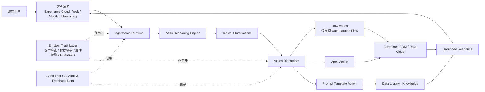

# Agentforce 架构总览（Architecture Overview）

- 版本: v3
- 最后更新: 2026-02-26
- 适用范围: Salesforce Agentforce Service Agent（含 Data Cloud、Experience Cloud、MIAW）
- 来源文档: `99-Inbox/Agentforce.pdf`

## 目录

- [Summary](#summary)
- [Decision / Changes](#decision--changes)
- [1. Agentforce 全貌](#1-agentforce-全貌)
- [2. 逻辑架构图](#2-逻辑架构图)
- [3. 核心组件与职责](#3-核心组件与职责)
- [4. 数据基础与知识接地](#4-数据基础与知识接地)
- [5. 运行与交付流程](#5-运行与交付流程)
- [6. 渠道接入架构](#6-渠道接入架构)
- [7. 安全与治理模型](#7-安全与治理模型)
- [8. 运营与持续优化](#8-运营与持续优化)
- [Risks / Known Issues](#risks--known-issues)
- [Next Steps](#next-steps)

## Summary

Agentforce 不是传统 FAQ 机器人，而是可在 Salesforce 生态内执行“理解意图 -> 推理决策 -> 调用动作 -> 返回结果”的自治型 AI Agent 体系。  
其核心由 Agent Runtime、Atlas Reasoning Engine、Topics/Instructions、Actions（Flow/Apex/Prompt Template）、Data Cloud/CRM 数据、Einstein Trust Layer 与审计能力共同组成。  
通过 Experience Cloud、Embedded Service、Messaging for In-App and Web（MIAW）与 Omni-Channel，Agentforce 可以在 Web、移动端和客服工作台统一接入并进行路由与交接。

## Decision / Changes

1. 将原文档从“通用分层说明”升级为“基于官方操作手册的端到端架构全景”。
2. 明确 Agentforce 的关键内核组件、动作执行边界、渠道发布链路与安全分类（Public/Private Action）。
3. 补充可落地的运行流程：构建、测试、激活、发布、路由、审计、持续优化。

## 1. Agentforce 全貌

Agentforce 的目标是基于 Customer 360 与业务数据，实现以下能力：

1. 自主执行复杂任务，而不只生成对话文本。
2. 按业务主题（Topic）组织能力，并以动作（Action）驱动执行。
3. 在跨渠道场景下持续服务（7x24）并支持人工升级与交接。
4. 在安全约束下处理敏感操作，支持可追踪、可审计、可反馈优化。

## 2. 逻辑架构图

## 3. 核心组件与职责

| 组件 | 职责 | 关键点 |
| --- | --- | --- |
| Agentforce Service Agent | 面向客户的自治型 AI Agent 运行时 | 负责理解意图、调用动作、生成回复 |
| Agent Builder | Agent 配置与激活工具 | 完成 Agent 创建、Topic/Action/Instruction 配置 |
| Atlas Reasoning Engine | 推理与规划内核 | 模拟人类思考流程，决定任务拆解与执行顺序 |
| Topics | 任务领域划分 | 用于意图归类与能力边界控制 |
| Instructions | Topic 内执行规则 | 约束响应风格、身份校验、失败分支、人机交接 |
| Actions（Flow/Apex/Prompt） | 具体执行单元 | 连接业务逻辑、自动化流程、知识模板 |
| Data Library | 可信知识输入 | 为回复提供上下文 grounding，减少幻觉 |
| Einstein Trust Layer | 安全与可信执行层 | 包含安全检索、数据保护、毒性检测等 |
| Audit Trail / AI Audit & Feedback Data | 审计与质量反馈 | 跟踪 agent 行为与输出，用于合规与优化 |

## 4. 数据基础与知识接地

Agentforce 依赖 Data Cloud 中统一后的 Customer 360 数据，并结合 Data Library 进行检索增强（RAG-like）与语义搜索。

| 数据类型 | 典型内容 | 业务价值 |
| --- | --- | --- |
| Reservation Data | 预订历史、入住偏好、取消历史 | 个性化推荐、行为预测 |
| Service Request & Support Data | 客诉、工单、聊天/通话记录 | 快速解决问题，降低重复投诉 |
| Messaging Data | 短信、邮件、WhatsApp 等互动 | 多渠道一致沟通 |
| Booking Channel Data | OTA/直连/GDS 来源、取消与时间特征 | 渠道策略优化与营销提升 |

## 5. 运行与交付流程

### 5.1 构建阶段（Build-Time）

1. 启用 Einstein Generative AI 与 Agents。
2. 在 Agent Builder 创建 Agent（Service Agent 类型）。
3. 关联 Data Library 与基础企业配置。
4. 新增 Topics，并在各 Topic 下配置 Actions（Flow/Apex/Prompt Template）。
5. 增加 Instructions（输入处理、身份验证、异常路径、升级策略）。
6. 激活 Agent。

### 5.2 运行阶段（Run-Time）

1. 用户请求进入渠道端。
2. Runtime 使用 Atlas + Topic 进行意图理解与任务规划。
3. 根据 Topic 指令触发对应 Action。
4. 从 CRM/Data Cloud/Data Library 获取上下文与事实。
5. Einstein Trust Layer 执行安全控制（如数据保护、毒性检测）。
6. 返回结果，必要时升级到人工坐席。
7. 全程写入 Audit Trail 与反馈数据。

### 5.3 验证阶段（Test/Activate）

1. 在 Conversation Preview 中反复测试提示词与分支。
2. 对关键 Topic 做正向、异常、权限与升级路径验证。
3. 满足预期后再进行发布。

## 6. 渠道接入架构

### 6.1 Experience Cloud 发布

1. 在 All Sites 中进入站点 Builder 并发布站点。
2. 配置 Embedded Service Deployment 并重新发布。
3. 启用 Einstein Service Agent（ESA）相关 Messaging 通道。

### 6.2 MIAW（In-App/Web）与 Omni-Channel

1. 启用 Omni-Channel。
2. 创建 Omni-Channel Flow（`recordId` 输入必须严格区分大小写）。
3. 在 `Route Work` 动作中将会话路由至 Queue/Agent/Bot/Skills。
4. 新建并激活 Messaging Channel（Routing Type = Omni Flow）。
5. 在 Web App / Lightning App / Mobile App 中挂载消息组件与控制台能力。

## 7. 安全与治理模型

### 7.1 Action 分类

| 类型 | 定义 | 认证要求 |
| --- | --- | --- |
| Public Action | 可代表任何用户执行，基于公开信息 | 通常不需身份认证 |
| Private Action | 仅可代表特定用户执行敏感动作 | 必须完成身份确认与授权校验 |

### 7.2 安全实施原则

1. 最小权限原则：Agent 仅授予完成任务所需的最低权限。
2. 强认证：对 Private Action 建议启用双因子或等效机制。
3. 会话绑定：将已验证身份与 MessagingSession / MessagingEndUser 关联。
4. 输入与错误治理：做输入校验，避免将内部错误细节直接暴露给终端用户。
5. 审计巡检：定期检查访问日志、动作调用与异常分布。

### 7.3 Einstein Trust Layer 框架要点

1. 五项可信原则：`Accuracy`、`Safety`、`Transparency`、`Empowerment`、`Sustainability`。
2. 关键控制能力：
   - Secure Retrieval / Grounding
   - Data Masking（请求前脱敏、响应后重建）
   - Toxicity Detection（安全评分与拦截）
   - Audit Trail 与反馈闭环
3. 第三方模型治理：外部模型调用场景采用零留存承诺与数据保护策略。
4. 实施要求：高风险业务场景应配合人审，不应完全依赖模型自动输出。

## 8. 运营与持续优化

1. 以 Audit Trail + AI Audit & Feedback Data 建立质量闭环。
2. 持续迭代 Topics/Instructions/Actions，减少误判和无效调用。
3. 重点监控三类指标：动作成功率、人工升级率、安全拦截命中率。
4. 保持多渠道一致性，确保 Web、移动端、客服控制台行为一致。

## Risks / Known Issues

1. Flow Action 目前仅支持 Auto-Launch Flow，复杂交互场景需要 Apex 或渠道侧补偿设计。
2. 文档提到的 token 鉴权方式存在“授权后无法即时失效”的风险，需要通过有效期与轮换策略缓解。
3. 本文基于给定 `Agentforce.pdf` 归纳，未覆盖该文档之外的 Salesforce 新特性差异。

## Next Steps

1. 将本总览映射到当前组织的真实对象、Flow、Apex 与权限模型，形成“组织专属版本”。
2. 为每个 Private Action 补齐认证步骤、授权矩阵与失败回退路径。
3. 建立最小可用评测集（核心 Topic + 异常案例 + 安全案例），并纳入每次发布前验证。
