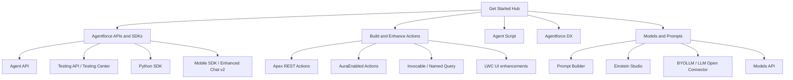

# Agentforce Developer Get Started 知识整理

- 版本: v2
- 最后更新: 2026-02-26
- 主要来源: https://developer.salesforce.com/docs/ai/agentforce/guide/get-started.html

## Summary

`Get Started with Agentforce and AI Agents` 这页本质上是 Agentforce 开发者入口页，定位是“导航页（hub）”，核心信息是：

1. Agentforce 是 Salesforce 平台上的 agent 层，用于部署可扩展的 AI agents。
2. Trust Layer 是连接企业数据与 LLM 的安全层。
3. 开发路径分为三大块：
   - `APIs and SDKs`
   - `Actions`
   - `Models and Prompts`
4. 这页不讲实现细节，主要提供分流入口到各专题文档。

## Decision / Changes

1. 将该 URL 的信息沉淀为“知识地图”而非逐段翻译，便于后续查阅和实施落地。
2. 补充每个入口的“适用场景”和“你应该先读什么”，减少资料跳转成本。
3. 统一归档到 `01-Concepts`，作为 Agentforce 开发入口基线文档。

## 1. 页面定位与价值

该页面对应的是开发者总览入口，而非单一功能文档。  
可把它理解为 Agentforce 的“官方目录首页”，用于快速回答两个问题：

1. 我要用哪类能力（Builder、API、SDK、Prompt、Actions）？
2. 我应该从哪个文档起步？

## 2. 核心入口知识图谱

## 3. 各入口的实用解读

### 3.1 Agentforce APIs and SDKs（先看这个）

适合你要做以下工作时阅读：

1. 用 API 调用 Agent（如外部系统、网站、后端服务）。
2. 用 SDK 把 Agent 能力带到移动端或聊天端。
3. 想把 Agent 测试和交付纳入 CI/CD（DX + Testing API）。

关键能力划分（页内说明）：

1. `Agent API`: 通过 REST 与 Agent 会话。
2. `Testing API`: 程序化测试 agent 行为。
3. `Agentforce DX`: 用 CLI/VS Code 做 pro-code 开发与发布。
4. `Agentforce Python SDK`: 代码化创建/管理 agents。
5. `Mobile SDK / Enhanced Chat v2`: 面向终端交互体验接入。

### 3.2 Build and Enhance Agentforce Actions

适合你要扩展 Agent 执行动作时阅读：

1. 基于 Apex REST / Apex 控制器 / Invocable Method 创建动作。
2. 用 Named Query 暴露可复用查询动作。
3. 给复杂输入输出增加 Lightning 类型和 UI 增强。
4. 给响应增加引用（citations）和可复制能力（global copy）。

### 3.3 Agent Script

适合你既要 LLM 灵活性，又要可控流程时阅读：

1. 用条件表达式、变量和转场做确定性控制。
2. 明确“哪里让模型推理，哪里必须程序化执行”。
3. 结合 Builder Canvas 和 Script 视图进行可视化 + 代码化协作。

### 3.4 Agentforce DX

适合团队工程化场景：

1. 把 agent 元数据放入版本库，进入标准 DevOps。
2. 支持 org 内低代码和本地 pro-code 双向迭代。
3. 支持在 CLI 中做 preview、测试、发布与回收同步。

### 3.5 Models and Prompts

适合模型与提示工程层面：

1. `Prompt Builder`: 管理提示模板并绑定 CRM 数据。
2. `Einstein Studio`: 配置和测试模型。
3. `BYOLLM` 与 `LLM Open Connector`: 接入外部或自建模型。
4. `Models API`: 从 Apex/REST 调用文本、会话、向量能力。

## 4. 推荐阅读顺序（开发视角）

### 路径 A：先上线一个可用 Agent（低风险）

1. Get Started Hub
2. Agentforce APIs and SDKs
3. Build and Enhance Actions
4. Models and Prompts
5. Agent Script（需要精细控制时再深入）

### 路径 B：工程化交付（团队协作）

1. Get Started Hub
2. Agentforce DX
3. Testing API / Testing Center
4. Actions
5. Models and Prompts

### 路径 C：外部系统或 App 集成

1. Get Started Hub
2. Agent API
3. Mobile SDK / Enhanced Chat v2
4. Actions（补执行能力）

## 5. 与当前知识库的映射建议

| 官方入口 | 建议映射到本仓库 |
| --- | --- |
| Get Started Hub | `01-Concepts`（本页） |
| APIs and SDKs | `04-Integration` |
| Actions | `02-Build-HowTo/Actions` |
| Agent Script / DX | `02-Build-HowTo` + `06-Patterns` |
| Models and Prompts | `03-Prompting` |

## 6. 信任框架（Einstein Trust Layer）

`trust.html` 对 Agentforce 的可信 AI 治理给出了统一框架，可归纳为三层：

1. 原则层（Trusted AI Principles）：
   - `Accuracy`
   - `Safety`
   - `Transparency`
   - `Empowerment`
   - `Sustainability`
2. 控制层（Trust Controls）：
   - Secure Data Retrieval / Grounding
   - Data Masking
   - Toxicity Detection / Scoring
   - Audit Trail / Feedback Data
   - Third-party model zero-retention commitments
3. 运营层（Human + Process）：
   - 高风险输出的人审闭环
   - 线上日志审计与异常回放
   - 提示词/动作/权限的持续回归评估

落地建议：

1. 先做数据分级，再配置 masking 与可访问边界。
2. 对外发信和客户沟通场景开启更严格的 toxicity 与人工复核。
3. 把 Trust 指标纳入发布门槛（准确率、安全拦截、误报率、可追溯性）。

## Risks / Known Issues

1. 该页面是导航页，信息密度高但细节少，不能直接替代实施文档。
2. 不同入口文档更新节奏不一致，跨页引用时可能出现版本差异。
3. Help 文档与 Developer 文档在步骤层面偶尔有口径差异，需要以 org 实测校准。

## Next Steps

1. 基于本页入口，继续整理以下二级文档：
   - Agent API 入门与会话生命周期
   - Agentforce DX 工程化流程
   - Actions 设计与扩展模式
2. 将每条路径补一份“最小可运行示例”（MVP checklist）。
3. 建立一个“官方文档 -> 本仓库”映射表，减少重复检索时间。

## Sources

1. https://developer.salesforce.com/docs/ai/agentforce/guide/get-started.html
2. https://developer.salesforce.com/docs/ai/agentforce/guide/get-started-agents.html
3. https://developer.salesforce.com/docs/ai/agentforce/guide/get-started-actions.html
4. https://developer.salesforce.com/docs/ai/agentforce/guide/agent-script.html
5. https://developer.salesforce.com/docs/ai/agentforce/guide/agent-dx.html
6. https://developer.salesforce.com/docs/ai/agentforce/guide/models-get-started.html
7. https://developer.salesforce.com/docs/ai/agentforce/guide/trust.html
8. https://developer.salesforce.com/docs/ai/agentforce/guide/models-api-data-masking.html
9. https://developer.salesforce.com/docs/ai/agentforce/guide/models-api-toxicity-scoring.html
