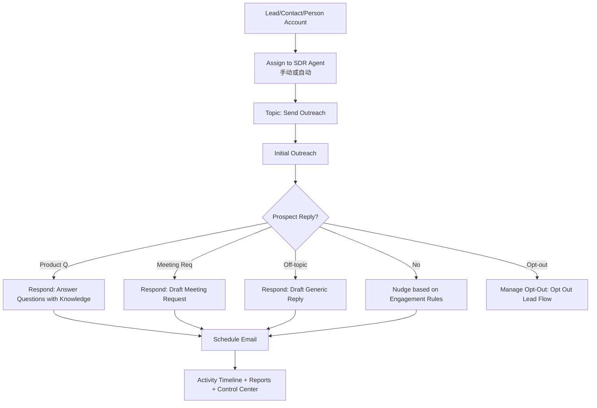

# Agentforce for Sales 实装指南（Sales Development）

- 版本: v1
- 最后更新: 2026-02-26
- 文档类型: Implementation Guide / Runbook
- 目标读者: Salesforce Admin、Sales Ops、实施顾问、SDR 负责人
- 来源: `99-Inbox/Agentforce-for-Sales-Development-Implementation-Guide.pdf`（May 2025）

## 目录

- [Summary](#summary)
- [Decision / Changes](#decision--changes)
- [1. 范围与目标](#1-范围与目标)
- [2. 前置条件与许可](#2-前置条件与许可)
- [3. 角色与权限模型](#3-角色与权限模型)
- [4. 默认能力与运行架构](#4-默认能力与运行架构)
- [5. 端到端实装步骤](#5-端到端实装步骤)
- [6. 测试与验收](#6-测试与验收)
- [7. 上线运营与 ROI 监控](#7-上线运营与-roi-监控)
- [8. 推荐定制项](#8-推荐定制项)
- [9. 排障速查](#9-排障速查)
- [Risks / Known Issues](#risks--known-issues)
- [Next Steps](#next-steps)
- [附录 A：关键对象与术语](#附录-a关键对象与术语)
- [附录 B：变更记录](#附录-b变更记录)

## Summary

这份文档将 `Agentforce for Sales Development` 的官方实施内容，整理为可执行的实装手册。  
核心目标是让团队在 Salesforce 中完成以下闭环：

1. 启用 Agentforce for Sales（SDR）。
2. 完成权限、Agent User、EAC、Inbox、Data Library 等依赖配置。
3. 通过 Agent Builder + Testing Center + Dummy Lead 完成上线前验证。
4. 以 Control Center 与标准报表持续监控质量、效率和 ROI。

## Decision / Changes

1. 采用“四阶段实施模型”：`Enable -> Create/Configure -> Test/Preview -> Runtime/Monitoring`。
2. 将 PDF 中分散的页面说明整合为单一执行手册，补齐前置检查、验收标准、风险与排障。
3. 对指南中的关键限制（发送上限、批量激活节流、EAC 认证方式、披露合规）集中治理。

## 1. 范围与目标

### 1.1 适用场景（Use Case Fit）

满足以下条件时，建议优先落地 Agentforce SDR：

1. 入站线索（Leads）量大，人工无法及时跟进。
2. 主要通过 Email 与潜客沟通。
3. 需要自动化线索培育（Nurture）与预约会议。
4. 希望把低价值重复工作从销售代表转移给 AI Agent。
5. 希望在线索被转人工前收集更多上下文信息。

### 1.2 不在本指南覆盖范围

1. 非 Email 主渠道（如电话/社媒）策略设计。
2. 自定义 LWC/外部系统深度编排开发细节。
3. 法务条款落地文本（仅做风险提示，不替代法律审阅）。

## 2. 前置条件与许可

### 2.1 技术前置检查（必须全部满足）

| 维度 | 检查项 |
| --- | --- |
| 对象模型 | 已使用或计划使用 `Lead` / `Contact` / `Person Account` |
| 数字渠道 | 使用 Email 触达潜客 |
| Agent 邮箱 | 可提供专用企业域名邮箱供 SDR Agent 使用 |
| EAC | 愿意启用 Einstein Activity Capture，并接受邮件数据捕获到 Hyperforce/AWS |
| Activity 方案 | 指南中要求“当前不使用 Activity 360”场景需额外评估兼容性 |
| 会议预订 | 愿意使用 Salesforce Inbox（替代第三方预订工具） |
| Sandbox | Sandbox 中 Data Cloud 已正确启用 |

### 2.2 功能与 SKU 依赖

| 功能 | 用途 | 备注 |
| --- | --- | --- |
| Einstein Copilot / Einstein Generative AI | 解锁 Agentforce 平台能力 | Einstein for Sales |
| Einstein Activity Capture (EAC) | 访问与捕获 Agent 邮件活动 | 用于外呼与回复生成 |
| Sales Engagement | 外呼节奏（Cadence）引擎 | Agentforce SKU 含 1 个相关许可 |
| Automated Actions | 线索加入/移出 Cadence | 必需 |
| Salesforce Inbox | 生成卖家会议链接 | 无 Inbox 时回退为邮箱联系 |
| Data Cloud（RAG） | 用企业知识回答问题 | 回答产品问题的关键依赖 |

### 2.3 上线准备清单（组织与流程）

1. 明确创建/测试/生产使用/Prompt 审核责任人。
2. 明确哪些 Lead 分配给 Agent，如何分群。
3. 准备知识文件（FAQ、产品文档、白皮书、价目等）。
4. 准备 Agent 专用邮箱（仅供 Agent 使用）。
5. 提前走完 Inbox 的安全审批流程（如企业要求）。

## 3. 角色与权限模型

### 3.1 权限集建议（按角色）

| 角色 | 必需权限集（建议基线） | 用途 |
| --- | --- | --- |
| SDR Agent User（机器人用户） | `Agentforce SDR Agent` | 自动触达、执行 Cadence、完整报告能力 |
| Sales Manager / Admin | `Configure Agentforce SDR Agent` + `Sales Engagement Cadence Creator` + `Automated Actions User` + `Data Cloud User` | 配置、管理、部署 Agent |
| Sales User | `Use Agentforce SDR Agent` + `Sales Engagement User` + `Automated Actions User` | 手动激活/协作 Agent、发送线索给 Agent |
| Sales User（邮件能力） | `Inbox With Einstein Activity Capture` 或其他 Inbox 权限包 | 查看/改期/取消 Agent 邮件、会议链接能力 |

说明: 指南不同页面对 Data Cloud 权限表述存在 `Data Cloud User`/`Data Cloud Admin` 差异，建议以你当前 org 的最小权限可行为准做验证。

### 3.2 关键权限约束

1. 仅具备相应 admin 权限的用户可创建 SDR Agent。
2. 仅可创建 1 个 Sales Development Agent / org。
3. 被抄送（CC）不需要特殊权限。

## 4. 默认能力与运行架构

### 4.1 Sales Agent 的 5 个属性

1. `Role`: 做什么工作（Lead Nurture）。
2. `Data`: 可访问哪些数据（CRM + 外部知识）。
3. `Channel`: 在哪里工作（Email）。
4. `Actions`: 具备什么执行能力（起草、回复、Opt-Out 等）。
5. `Guardrails`: 不该做什么（合规、安全、权限边界）。

### 4.2 默认 Topic 与 Action（OOTB）

| Topic | 默认 Action | 触发条件（摘要） |
| --- | --- | --- |
| Send Outreach | `Draft Initial Outreach Email` / `Draft Nudge Email` / `Schedule Email` | 新分配线索或未回复 |
| Respond to Prospect | `Draft Meeting Request Email` / `Draft Generic Reply Email` / `Draft Email for Lead Question` / `Answer Questions with Knowledge` | 潜客回复问题/约会/离题 |
| Manage Opt-Out | `Opt Out Lead`（Flow） | 潜客要求停发邮件 |

### 4.3 运行流（逻辑）

## 5. 端到端实装步骤

### 5.1 阶段 1: Enable Agentforce for Sales

1. 在 `Setup -> Salesforce Go` 中开启 Agentforce。
2. 确认 Agentforce 已启用，并可见 Sales Agent 模板。
3. 启用 `Sales Agent for Lead Nurturing`。
4. 读取并确认激活提示与免责声明。

### 5.2 阶段 2: 授权与用户访问

1. 为管理员分配配置权限（见 3.1）。
2. （可选）为销售用户分配 `Use Agentforce SDR Agent`。
3. 为需要与邮件交互的销售用户分配 Inbox 相关权限。

### 5.3 阶段 3: 在 Agent Builder 创建与配置 SDR Agent

1. 进入 Agent Builder，先检查默认 Topics/Actions。
2. 配置基础信息（Name/Description/Company）。
3. 配置 Agent User：
   - 可选择已有用户，或系统自动创建新 Agent User。
   - 必须看到 `User Verified`。
4. 开启 `Enrich Event Logs with Conversation Data`（审计建议开启）。
5. 上传知识文件到 Data Library（可选但强烈建议）：
   - 支持 `text`/`html`（单文件最大 4MB）、`pdf`（单文件最大 100MB）。
6. 连接 Agent 邮箱账号：
   - Agent Builder 中连接的邮箱地址必须与 Agent User 记录中的邮箱一致。
7. 配置 Engagement Rules：
   - Maximum Attempts
   - Time Between Attempts
   - Maximum Number of Replies
   - Outreach Schedule（测试期建议 `00:00-23:59` 每天）
8. 配置 Entity Assignments：
   - 支持 `Lead` / `Contact` / `Person Account`（Person Account 仅在 org 开启后可见）。
9. 保存并创建 Agent。

### 5.4 阶段 4: EAC 与 Inbox 完整配置

1. 给 SDR Agent 用户完成 EAC 接入：
   - 创建 EAC 配置并加入 Agent 用户。
   - `Email sync` 必须开启。
   - SDR Agent 必须使用 `user-level auth`（不要使用 org-level auth）。
2. 建议将 EAC sharing 调整为可见（Public），保证活动可查看。
3. 让销售用户连接自己的 Email/Calendar 账号到 Inbox。
4. 验证至少一个 Inbox 权限包已分配给销售用户。

### 5.5 阶段 5: 可选手工创建 Agent User（自动创建失败时）

1. 新建 User，`User License = Einstein Agent`，`Profile = Einstein Agent User`。
2. 为该用户分配 `Agentforce SDR Agent` 权限集。
3. 确认该用户可访问 Data Cloud 默认 Data Space（`Default`）。
4. 再回到 EAC 与 Agent Builder 完成绑定。

## 6. 测试与验收

### 6.1 Conversation Preview（单用例）

在 Agent Builder 的 Preview 中，按场景设置条件并输入固定测试语句。

| 场景 | 关键 Preview 条件 | 建议测试语句（摘自指南） | 预期 |
| --- | --- | --- | --- |
| Intro | Email Scenario=`Intro`；Email Body 为空；Inbox None | `Draft an Initial Outreach email but do not schedule the email. Your response should be a text-formatted email and not JSON.` | 调用 SendOutreach + Draft Initial Outreach |
| Nudge | Email Scenario=`Nudge`；提供上封邮件正文；Inbox True/False；Last Nudge True/False | `Draft a nudge email but do not schedule the email. Your response should be a text-formatted email and not JSON.` | 调用 SendOutreach + Draft Nudge |
| Reply | Email Scenario=`Reply`；Email Body=问题/约会/离题；Inbox True/False | `Draft a reply email but do not schedule the email. Your response should be a text-formatted email and not JSON.` | 根据邮件内容命中相应 Reply Action |

提示: 若未按指定 utterance 测试，常见现象是触发 `schedule email` 类错误，这是为了避免测试邮件误发。

### 6.2 Testing Center（批量回归）

#### Intro 场景 context variables

1. `Email Scenario`
2. `Record`
3. `Action cadence Step Tracker ID`
4. `Record Type`

#### Nudge 场景 context variables

1. `Test as Last Nudge`
2. `Email Scenario`
3. `Record`
4. `Email Body`
5. `Action Cadence Step Tracker ID`
6. `Record Type`

#### Reply 场景 context variables

1. `Email Scenario`
2. `Record`
3. `Email Body`
4. `Action Cadence Step Tracker ID`
5. `Record Type`
6. `Lead Owner's Inbox Enabled`

Reply 场景建议至少覆盖三类 `emailBody`：

1. 产品问题 -> 预期 `Answer Questions with Knowledge` + `Draft Email for Lead Question`
2. 约会请求 -> 预期 `Draft Meeting Request Email`
3. 离题问题 -> 预期 `Draft Generic Reply Email`

### 6.3 Dummy Lead 端到端验证

1. 在 Lead 页面布局加入 `Activate Agentforce SDR` 动作。
2. 创建测试 Lead（建议填充 Company/Lead Source/Industry）。
3. 测试邮箱域名不得与 Agent 用户相同域，避免被识别为内部邮件。
4. 手动激活或通过规则自动分配给 Agent。
5. 验证：
   - 首封外呼已出现在 Activity Timeline。
   - Nudge 按 `Time Between Attempts` 调度。
   - Reply/Meeting/Opt-Out 分支行为与预期一致。

### 6.4 上线前验收门槛（建议）

1. 权限与依赖检查项全部通过（EAC、Inbox、Data Cloud、Agent 邮箱）。
2. 单测（Preview）三大场景全部通过。
3. 批测（Testing Center）核心样本通过率 >= 95%。
4. Dummy Lead E2E 完整跑通（含 Opt-Out、Meeting、QnA）。
5. 关键报表可出数（Leads with Cadence Trackers、Monthly Metrics 等）。

## 7. 上线运营与 ROI 监控

### 7.1 Control Center

通过 `Agentforce SDR` Tab 监控：

1. 质量（Quality）
2. ROI
3. 生产力
4. 负载容量

若看不到 Tab，需要在 Profile/Permission Set 与 Lightning App 中显式开放。

### 7.2 推荐报表（指南给出的可行基线）

| 报表 | 关键过滤条件 | 用途 |
| --- | --- | --- |
| Lead Owners Using Agentforce | Cadence Assignee = Agent User | 统计哪些销售正在被 Agent 支持 |
| Leads Currently Running | Cadence State in Running/Initializing/Processing | 当前活跃线索池 |
| Total Leads Worked by Agent | Cadence Assignee = Agent User | 累计处理量 |
| Monthly Email Metrics | Cadence Id = Agentforce SDR cadence | 邮件发送/打开/回复/点击（月度） |
| Total Opt Outs | Target Disposition = Opt Out | 退订量 |
| Total Meetings Requested | Target Disposition = Meeting Requested | 会议请求量 |
| Leads Converted / Agent-Influenced Opportunities | Lead Converted = True | 转化与机会影响 |
| Agent-Scheduled Emails | Task Assigned = Agent User, Status = In Progress | 待发送邮件检查 |
| Bounced Emails | Target Disposition = Bad Data | 邮件退回与数据质量问题 |

## 8. 推荐定制项

### 8.1 低成本高收益优先级

1. 调整 Lead Assignment + Outreach Settings（低成本，中收益）。
2. 上传公司知识文件或连接知识库（低成本，高收益）。
3. 定制 Prompt Templates（中高成本，中高收益）。

### 8.2 可扩展定制（来自指南）

| 定制目标 | 建议做法 |
| --- | --- |
| 根据互动更新 CRM 字段 | 新建 Flow Action，并在 Topic 指令中提升优先级 |
| 根据互动创建销售任务 | 新建 Flow Action + 指令调整 |
| 调整首封邮件 AI 披露文案 | 修改 Intro Prompt Template（正文披露） |
| 多语言触达 | 基于 Lead 字段覆盖语言策略与 Prompt |
| 使用通用会议链接 | Prompt 内嵌通用链接，并把 `Lead Owner has Inbox Disabled` 固化 |
| 会议前资格问题收集 | 新建 Flow + 更新 Respond to Prospect 指令 |
| 使用 Data Cloud 字段个性化 | 在 Prompt 中接入 Data Cloud merge fields |
| 满足条件时停止后续触达 | 基于 OOTB `Opt Out Lead` 扩展 Flow |

### 8.3 Prompt 调优重点区块

优先调整以下 header 段：

1. `###PROSPECT_INFORMATION`
2. `###AGENT_INFORMATION`
3. `###EMAIL_SUBJECT_LINE`
4. `###EMAIL_BODY`
5. `###LANGUAGE_TONE_AND_STYLE`
6. `###INDUSTRY_AND_TITLE-BASED_KPI`（仅部分模板）

Prompt 写作守则（指南建议）：

1. 用 `must/strictly/always/never` 代替弱约束词。
2. 对空 merge fields 设置兜底规则，避免 hallucination。
3. 用清晰分段（`###` 或 `"""`）组织指令。
4. 避免“indirectly/subtly/convey”一类模糊指令。

## 9. 排障速查

| 现象 | 高概率原因 | 处理动作 |
| --- | --- | --- |
| Agent 不工作 | Agent 在 Builder 中未激活 | 重新激活 Agent |
| 无法起草邮件 | Prompt Template 未全部激活 | 激活全部 SDR Prompt Templates |
| 无会议链接 | Lead Owner 未启用 Inbox 或未连接邮箱 | 完成 Inbox 权限与账号连接 |
| “Emails are not shared with you” | Activity Sharing 为 `Don't Share` | 在 Agent Builder 编辑并保存 Engagement Rules，刷新共享设置 |
| 回复邮件异常/失败 | Agent User 邮箱与连接账号不一致；EAC 复用冲突；同域内部邮件 | 校验邮箱唯一性与域名策略，避免复用 |
| 改期时报 “action isn’t available” | 页面布局缺少 email quick action | 补加 Email Quick Action 到布局 |
| 邮件发送延迟 | 服务端队列积压 | 等待队列处理并监控重试 |

## Risks / Known Issues

1. 单 org 仅允许 1 个 Sales Development Agent，无法做多 Agent 并行对比。
2. 每个 Agent 每天最多约 1800 封邮件（受邮件服务商规则约束）。
3. 批量自动激活建议每批 <= 30 条，批次间隔 >= 2 分钟。
4. 目前无“回复优先于 Nudge”的细粒度治理开关。
5. Email sign-off 的 AI disclosure 在当前版本不可移除，且默认不可自定义。
6. EAC 若配置为 org-level auth，会导致 SDR Agent 行为异常。
7. 指南中部分权限命名存在版本差异（Data Cloud User/Admin），需在目标 org 校验。
8. 部分行为描述存在口径差异（如发送延迟），需以实测结果和日志为准。

## Next Steps

1. 按本文第 2 章做一次 org readiness 评审，输出 gap 清单。
2. 建立你们自己的 Testing Center CSV 用例库（按 Intro/Nudge/Reply 三类维护）。
3. 建立首版运营看板，至少覆盖 Meetings、Opt-Out、Conversion、Bounce 四类结果指标。
4. 根据 8.2 的定制项做优先级排序，先交付“高影响低成本”改造。

## 附录 A：关键对象与术语

1. `Leads`: Agent 主要触达对象。
2. `Cadences`: 触达节奏编排基础。
3. `Cadence Tracker`: 记录线索在节奏中的位置。
4. `Cadence Step Tracker`: 记录每一步状态（到期/逾期/完成）。
5. `Lead Owner`: 人类销售负责人。
6. `Agent User`: Agent 对应系统用户（执行动作，不拥有 Lead）。

## 附录 B：变更记录

| 日期 | 版本 | 变更内容 | 作者 |
| --- | --- | --- | --- |
| 2026-02-26 | v1 | 基于官方实施指南整理为中文实装手册 | Codex |
