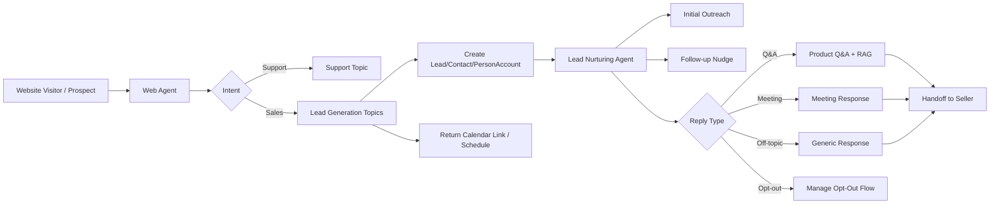

# Agentforce Sales 实施知识整理（Lead Generation + Lead Nurturing）

- 版本: v1
- 最后更新: 2026-02-26
- 来源文档: `99-Inbox/agentforce-sales-implementation-guide.pdf`（Updated Oct 2025）
- 适用范围: Agentforce Sales（Web 线索生成 + Email 线索培育）

## Summary

该实施指南将 Agentforce Sales 拆为两条主链路：

1. `Lead Generation`：在 Web 渠道中识别销售意图、采集潜客信息、创建记录并预约会议。
2. `Lead Nurturing`：在 Email 渠道持续自动外呼、跟进、答疑和转人工（含会议交接与退订处理）。

与旧版仅聚焦 SDR 线索培育的文档相比，这份 2025-10 版本新增了 `Inbound Lead Generation` 的标准化 no-code 启用路径，并强化了 Go 引导配置、渠道接入和运行监控说明。

## Decision / Changes

1. 新建本文件，沉淀一份覆盖 Lead Generation + Lead Nurturing 的统一实施手册。
2. 采用“阶段化实施”结构：`Enable -> Create/Test -> Runtime/Monitoring`。
3. 增补两条链路的权限模型、关键配置点、上线验收项与限制条件。

## 1. 全景架构

## 2. 前置条件矩阵

### 2.1 Lead Generation（Web）

| 维度 | 要求 |
| --- | --- |
| 对象 | `Lead` / `Contact` / `Person Account` |
| 渠道 | Website + Messaging for In-App and Web（MIAW） |
| 相关能力 | Omni-Channel、Digital Engagement |
| 会议能力 | Salesforce Inbox 或自定义会议链接方案 |
| 路由规则 | 建议已有 Lead Assignment Rules |
| Sandbox | Data Cloud 已启用 |

### 2.2 Lead Nurturing（Email）

| 维度 | 要求 |
| --- | --- |
| 对象 | `Lead` / `Contact` / `Person Account` |
| 渠道 | Email |
| 相关能力 | Einstein Activity Capture（EAC） |
| 会议能力 | Inbox（可选；使用外部会议链接时可不启用） |
| 数据能力 | Data Cloud（用于 RAG 答疑） |
| Sandbox | Data Cloud 已启用 |

## 3. 权限模型（归纳）

| 角色 | 典型权限（按文档归纳） | 职责 |
| --- | --- | --- |
| Agent User | `Agentforce Service Agent User` / `Agentforce SDR Agent`（按模板场景）+ 数据访问权限 | 以系统身份执行自动触达、回复与动作 |
| Sales Manager / Admin | `Configure Inbound Lead Generation Agent` 或 `Configure Agentforce SDR Agent` + Data Cloud 管理类权限 | 配置、发布、运维 |
| Sales User | `Use Agentforce SDR Agent` + Inbox 权限包（如需会议链接与邮件协作） | 与 Agent 协作、手动触发、查看活动 |

说明: 文档存在不同场景下的权限命名差异（Lead Generation 与 Lead Nurturing页面），实施时应以当前 org 的权限集实际名称为准。

## 4. Lead Generation 实施流程（Web）

### 4.1 Enable（Go）

1. `Setup -> Salesforce Go` 打开 Agentforce。
2. 开启 `Inbound Lead Generation`。
3. 完成 Manager 权限分配。
4. 创建或选择 Agent User。

### 4.2 Create/Test（Builder）

1. 配置 Data Library（用于问答与 grounding）。
2. 在简化创建流程中选择 `Inbound Lead Generation` 模板。
3. 填写 Agent 基础信息与 Conversation Settings（价值主张、证明点等）。
4. 配置线索采集策略：
   - 记录类型（Lead/Contact/Person Account）
   - 默认 Status
   - OTP（可选）
   - Fallback Meeting Owner（需已连接 Inbox 邮箱）
5. 激活 Agent（此时仅完成配置，尚未对外上线）。

### 4.3 Runtime/Monitoring（渠道接入）

1. 在 Go 中执行 `Connect Channel`。
2. 选择 `Enhanced Chat`，配置 Web 部署信息。
3. 路由选择 `Agentforce Service Agent`，配置 fallback queue。
4. 在 Embedded Service Deployment 取得 `Code Snippet` 并嵌入网站。
5. 通过 `Omni Supervisor -> AI Agents` 监控线上会话。

## 5. Lead Nurturing 实施流程（Email）

### 5.1 Enable（Go）

1. 启用 Agentforce 后，开启 `Sales Agent for Lead Nurturing`。
2. 完成 Agent User 创建与校验。
3. 连接 Agent 邮箱和日历账户（EAC 链路）。

### 5.2 Create/Test（Builder）

1. 配置 Data Library（RAG 答疑依赖）。
2. 在简化创建流程中选择 `Lead Nurturing` 模板。
3. 配置 Email Settings：
   - 价值主张与 proof points
   - tone/style
   - 最大 nudge 次数
   - AI Disclosure 与 Opt-Out Message（当前版本可在简化配置中调整）
4. 配置 Reply Settings 并绑定知识库。
5. 配置 Prospect Assignment 规则（Lead/Contact/Person Account + 条件表达式）。
6. 激活后开始自动分配；未激活则仅可继续手动测试。

### 5.3 手动测试路径

1. 将 `Activate Assign to Agentforce SDR` 动作加入 Lead 页面布局。
2. 在测试 Lead 上手动触发，或通过字段变更命中自动分配规则。
3. 验证首封外呼、后续 nudge、回复分流、会议交接与退订动作。

## 6. Lead Nurturing OOTB Topics 与 Actions

| Topic | 作用 | 典型 Action |
| --- | --- | --- |
| Initial Outreach | 首封触达 | Get Record Details（Invocable） |
| Follow-up Outreach | 未回复跟进 | Get Record Details（Invocable） |
| Product Q&A | 产品问答与异议处理 | Answer Questions with Knowledge（RAG）+ Return Calendar Link（Flow） |
| Meeting Response | 约会请求响应 | Return Calendar Link（Flow） |
| Generic Response | 离题或非业务回复 | Get Record Details（Invocable） |
| Manage Opt-Out | 退订处理 | Opt Out（Flow） |

## 7. 验收建议（Go-Live Gate）

1. 前置条件全部满足（对象、渠道、Data Cloud、EAC、Inbox/替代方案）。
2. Agent User、Manager、Sales User 权限可通过最小权限操作验证。
3. 渠道上线链路打通（Channel -> Deployment -> 网站嵌入）。
4. 核心场景验证通过：
   - Web lead capture + create record + meeting routing
   - Email initial + nudge + reply + opt-out
5. 监控面板可见关键活动与错误信息。

## 8. 定制方向（高价值优先）

1. 按互动结果更新 CRM 字段（Flow Action）。
2. 根据互动创建 seller task（Flow/Action）。
3. 多语言策略（多 Agent 或单 Agent 指令增强）。
4. 使用通用会议链接替代 Lead Owner 链接（并调整 Inbox 条件指令）。
5. 用 Data Cloud 字段强化个性化回复。
6. 自定义“移出培育节奏”动作（基于 OOTB Opt-Out 扩展）。

## 9. 运行限制与排障重点

### 9.1 已知限制

1. 单 Agent 每日邮件发送受限（文档给出约 `1800/day`）。
2. 批量自动分配建议节流：每批不超过 `30`，批次间隔至少 `2` 分钟。
3. 暂无“回复优先于 nudge”的优先级治理开关。
4. 启用 Inbox 时可自动带会议链接；未启用时通常回退为 Lead Owner 联系方式。

### 9.2 常见故障

1. Agent 未激活导致无动作执行。
2. Agent 用户邮箱与连接账号不一致，影响 nudge/reply。
3. `Emails are not shared with you` 多与 Activity Sharing 配置相关。
4. 缺少 Email quick action 导致“action isn’t available”。
5. 同域发件/收件或 EAC 账号复用可能导致邮件处理异常。

### 9.3 Trusted URL 新要求

文档强调：Agentforce / Einstein GenAI 已加强 Trusted URL allowlist 管理。  
若外链域名未加入 Trusted URLs，可能被阻断。实施时应把外部表单、知识库、第三方链接提前加入白名单策略。

## Risks / Known Issues

1. 文档中权限集命名在不同章节存在差异，若直接照抄可能导致授权偏差。
2. 会议能力对 Inbox 或替代链接方案依赖明显，缺失会影响 handoff 体验。
3. Data Library 索引存在准备延迟，可能导致初期问答质量波动。
4. Lead Generation 与 Lead Nurturing 双链路并行时，若分配规则不清晰容易产生重复触达。

## Next Steps

1. 基于你们实际 org 输出一版“权限实配矩阵”（用户/权限集/对象/字段）。
2. 把本文第 7 章验收门槛转换成上线检查表并纳入发布流程。
3. 先完成 OOTB 上线，再按第 8 章逐步引入定制动作与提示词治理。
4. 建立月度复盘：会议转化率、退订率、邮件退回率、响应时延。

## 附录：关键信息追溯（页码）

| 主题 | 关键页码（PDF） |
| --- | --- |
| Lead Generation 启用与配置 | 14-56 |
| Lead Nurturing 架构与前置条件 | 63-71 |
| Lead Nurturing 启用与 Builder 配置 | 72-108 |
| Topics/Instructions 与定制建议 | 110-118 |
| 限制与排障 | 120-125 |
| Inbox 接入 | 126-133 |
