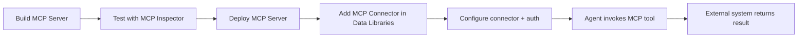

# MCP Solutions for Developers 知识整理

- 版本: v1
- 最后更新: 2026-02-26
- 主要来源: https://developer.salesforce.com/docs/ai/agentforce/guide/mcp.html

## Summary

Salesforce 的 MCP 文档给出的是“如何让 Agentforce 与外部系统通过 MCP 协议互操作”的开发者方案。  
核心流程是：

1. 本地用 MCP Inspector 验证 MCP Server。
2. 用 Heroku / MuleSoft / BYO Runtime 等方案部署 MCP Server。
3. 在 Agentforce 的 Data Libraries 中添加 MCP Connector。
4. 配置连接并让 Agent 调用外部工具能力。

## Decision / Changes

1. 新建 MCP 集成知识文档，明确开发与部署路径。
2. 重点沉淀“方案选型”和“端到端调用流程”。
3. 标注 Beta 属性与上线风险，避免误判稳定性。

## 1. MCP 是什么（在 Agentforce 里的角色）

1. MCP 是 Agent 与外部工具/数据源的标准协议层。
2. Agentforce 通过 MCP Connector 把外部能力接入到 Agent。
3. 业务价值是减少点对点定制连接，提高可复用性。

## 2. 端到端交互流程

## 3. 方案选型（按官方入口）

| 方案 | 适用场景 |
| --- | --- |
| Heroku MCP Starter / Heroku + Remote Connect | 希望快速上线、托管部署 |
| MuleSoft Agent2Agent + MCP Agent Gateway | 企业已有 MuleSoft 集成体系 |
| Bring Your Own Runtime | 有自建运行时与安全治理要求 |
| Local MCP Connector | 本地验证与开发联调 |

## 4. 推荐实施流程

1. 先用本地 Inspector 验证协议、工具列表、输入输出。
2. 再部署到目标运行环境（Heroku / MuleSoft / 自建）。
3. 在 Agentforce Data Libraries 添加 MCP Connector。
4. 配置鉴权与最小权限范围。
5. 在 Agent 侧做动作调用与回归测试。

## 5. 安全与治理要点

1. 对 MCP 工具做最小权限设计，不暴露多余能力。
2. 对高风险操作增加人工确认与审计记录。
3. 明确外部连接失败时的降级策略与错误处理。
4. 把 connector 变更纳入发布审批和回归流程。

## Risks / Known Issues

1. 文档标注为 Beta 方案，特性与接口可能变化。
2. 连接器配置错误会导致 Agent 工具调用失败或超时。
3. 如果外部系统不稳定，Agent 响应质量会直接受影响。

## Next Steps

1. 在仓库补一份 MCP 集成检查清单（环境、鉴权、连通、回退）。
2. 为关键 MCP 工具定义超时、重试和熔断策略。
3. 将 MCP 连接器调用纳入 Observability 指标体系。

## Sources

1. https://developer.salesforce.com/docs/ai/agentforce/guide/mcp.html
2. https://github.com/heroku-reference-apps/mcp-server-heroku-starter
