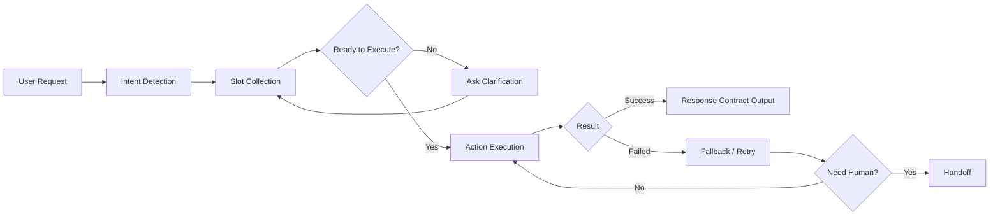

# 第1章 Agentforce 架构与术语

- 版本: v1
- 最后更新: 2026-02-28
- 章节定位: 基础必修
- 预计学习时长: 90-120 分钟

## Summary

本章建立 Agentforce 的统一认知框架，回答三个核心问题：

1. Agentforce 在 Salesforce 体系中的位置是什么。
2. 一个 Agent 在运行时如何完成“理解 -> 决策 -> 执行 -> 回复”。
3. 为什么 Topic/Action/Prompt/Guardrails 是开发与治理的最小单元。

完成本章后，学习者应能读懂 Agentforce 方案图，并独立解释核心术语及其边界。

## Decision / Changes

1. 本章优先强调“概念边界”，避免过早进入配置细节。
2. 使用统一的运行流程图，后续章节全部复用该模型。
3. 术语采用“中文主名 + 英文关键字”写法，便于跨团队协作。

## 1. 学习目标

### 1.1 知识目标

1. 说清 Agentforce 与 CRM、Data Cloud、Integration 的关系。
2. 说清 Topic、Action、Prompt、Guardrails、Handoff 的职责边界。
3. 理解 Einstein Trust Layer 对安全与合规的作用。

### 1.2 技能目标

1. 能将一个业务需求拆解为 Topic + Action + Guardrails。
2. 能识别“可以自动处理”与“必须人工接管”的场景。
3. 能使用本章术语进行方案评审沟通。

### 1.3 交付目标

1. 输出一张 Agentforce 逻辑架构图。
2. 输出一份术语表（不少于 15 个术语）。

## 2. 前置知识

1. Salesforce 对象模型基础（Lead/Contact/Case）。
2. 基本权限概念（Profile/Permission Set、CRUD/FLS/Sharing）。
3. API/Flow/Apex 基础认知（无需深入编码）。

## 3. 核心概念与架构

### 3.1 Agentforce 核心组件

| 组件 | 作用 | 常见误区 |
| --- | --- | --- |
| Agent Builder | 设计与配置 Agent 能力 | 误认为只需配置无需测试 |
| Topic | 意图路由与能力边界 | Topic 定义过大导致漂移 |
| Action | 可执行操作的契约化能力 | 输入/输出不清导致运行失败 |
| Prompt | 指令与行为规范载体 | 没有输出合同，难以回归 |
| Guardrails | 安全、权限、禁止项约束 | 仅靠文案约束而非机制约束 |
| Data Grounding | 回答依据与引用来源 | 未准备数据就直接上线问答 |

### 3.2 运行时流程（统一模型）

### 3.3 架构设计的五条原则

1. 单一职责：Topic 做路由，Action 做执行，Prompt 做约束。
2. 非推测：未知信息必须追问或转人工，不能编造。
3. 最小权限：默认拒绝，按需开放。
4. 可观测：每次关键决策都要可追踪。
5. 可回滚：发布必须有降级与回退路径。

## 4. 术语表（教材版）

| 术语 | 定义 | 示例 |
| --- | --- | --- |
| Topic | 一类业务意图与处理范围 | “案例查询” |
| Action | 可调用的执行能力 | “CreateCase” |
| Prompt Contract | 输出格式与行为约束 | 固定 JSON 字段 |
| Handoff | 转人工处理机制 | 转到 Support Queue |
| Grounding | 基于数据依据回答 | 引用知识文档 |
| Guardrails | 安全与权限限制 | 禁止越权读取 |
| Intent | 用户意图识别结果 | 查询进度 |
| Slot | 执行必需参数 | case_id |
| Fallback | 失败时替代策略 | 重试后转人工 |
| Eval Dataset | 回归评测数据集 | EVAL-XXXX |
| Release Gate | 上线门槛 | 通过率 >= 95% |
| Hallucination | 无依据生成 | 编造订单号 |
| CRUD/FLS/Sharing | 数据访问控制三层 | 对象/字段/共享 |
| p95 Latency | 95分位响应时延 | <= 8s |
| Request ID | 链路追踪标识 | 用于排障 |

## 5. 实操练习（必做 + 可选）

### 5.1 必做练习: 场景拆解

任务：将“客户咨询订单状态并要求修改收货地址”拆解为最小设计单元。

输出模板：

1. Topic: 订单查询与更新
2. 必需 Slot: order_id, account_id, new_address
3. Action:
   - GetOrderStatus
   - UpdateShippingAddress
4. Guardrails:
   - 未验证身份禁止更新地址
   - 不返回其他客户订单信息
5. Handoff 条件:
   - 身份校验失败 2 次
   - 地址变更触发高风险规则

预期结果：可形成一页 Topic 草图并通过同伴评审。

### 5.2 可选练习: 术语卡片

任务：选择 10 个术语，给出“定义 + 反例 + 纠偏建议”。

预期结果：形成团队统一术语库 v1。

## 6. 常见错误与排障

| 问题 | 现象 | 修正建议 |
| --- | --- | --- |
| Topic 过大 | 路由不稳定、答非所问 | 按业务目标拆 Topic |
| Action 契约不完整 | 调用失败无法定位 | 强制定义输入/输出/错误 |
| 无 Handoff 策略 | 失败时反复追问 | 设定明确转人工条件 |
| 忽略权限边界 | 越权风险 | 在设计阶段标注 CRUD/FLS |
| 只看功能不看监控 | 上线后难定位问题 | 提前定义日志字段与 KPI |

## 7. 练习题

### 7.1 选择题

1. 下列哪项最适合作为 Topic 的定义边界？
   - A. 按开发语言划分
   - B. 按业务意图与处理目标划分
   - C. 按部署环境划分
   - D. 按组织架构划分
2. 当必须参数缺失时，最优处理是？
   - A. 猜测并继续
   - B. 直接报错结束
   - C. 追问必需信息
   - D. 跳过 Action
3. 下列哪项属于 Guardrails？
   - A. 美化文案风格
   - B. 定义输出标题格式
   - C. 限制越权数据访问
   - D. 统计日报

答案：1-B，2-C，3-C。

### 7.2 实作题

题目：为“退款申请”设计一版 Topic 草案（包含 entry intents、out-of-scope、handoff criteria、3 个 Action）。

评分参考：

1. 边界清晰（40分）
2. 安全约束完整（30分）
3. 可执行性强（30分）

## 8. 验收标准（章节通过条件）

1. 能口头解释 15 个核心术语，正确率 >= 90%。
2. 能完成 1 份场景拆解草案，并覆盖 Topic/Action/Guardrails/Handoff 四要素。
3. 练习题得分 >= 80 分。

## 9. 参考资料

1. [../01-Concepts/Architecture-Overview.md](../01-Concepts/Architecture-Overview.md)
2. [../01-Concepts/Terminology.md](../01-Concepts/Terminology.md)
3. [../03-Prompting/Prompt-Structure-v1.md](../03-Prompting/Prompt-Structure-v1.md)
4. [../02-Build-HowTo/Topics/Topic-Design-Template.md](../02-Build-HowTo/Topics/Topic-Design-Template.md)
5. [../02-Build-HowTo/Actions/Action-Design-Template.md](../02-Build-HowTo/Actions/Action-Design-Template.md)

## 10. 版本敏感假设

1. 本章概念在平台版本间相对稳定，但 UI 菜单名称可能变化。
2. 章节示例中的权限名称为“参考命名”，以目标 org 实际值为准。

## Risks / Known Issues

1. 学习者容易把 Prompt 当成“万能层”，忽略 Action 契约与权限设计。
2. 仅靠课堂讲解容易形成“概念理解”，缺少“交付能力”。
3. 如无真实数据样本，实操环节会偏离生产场景。

## Next Steps

1. 进入第2章，完成前置条件与权限模型实操。
2. 为本章新增一页“术语速查图”用于课前预习。
3. 在试讲中收集 10 条反馈，修订示例难度与术语解释。
