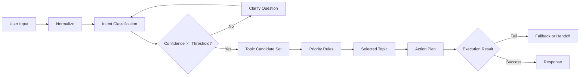

# 第4章 Topic 设计与路由策略

- 版本: v1
- 最后更新: 2026-02-28
- 章节定位: 开发设计核心
- 预计学习时长: 120-150 分钟

## Summary

本章解决 Agentforce 开发中最常见的质量问题: Topic 边界混乱与路由不稳定。  
核心目标是把“用户说什么”稳定映射到“系统该做什么”，并为失败场景提供可控回退。

完成本章后，学习者应能独立设计一版可上线的 Topic:

1. 入口意图明确，非范围意图清晰。
2. 路由规则可解释、可测试、可调优。
3. 人工接管条件明确，失败不悬空。

## Decision / Changes

1. 采用“意图驱动 + 规则补充”的 Topic 路由方法，不采用纯关键词硬匹配。
2. 统一 Topic 文档结构为 `Entry intents / Out-of-scope / Handoff / Action Plan / Test Cases`。
3. 将“路由置信度阈值”纳入验收标准，避免上线后漂移。

## 1. 学习目标

### 1.1 知识目标

1. 理解 Topic 的职责边界与粒度划分原则。
2. 理解路由策略中的意图识别、规则约束和优先级机制。
3. 理解多 Topic 冲突与失败回退的治理方式。

### 1.2 技能目标

1. 能将业务域拆解为多个可维护 Topic。
2. 能定义 Entry intents、Out-of-scope intents 与 Handoff criteria。
3. 能设计 Topic 级路由测试并评估命中质量。

### 1.3 交付目标

1. 一份 Topic 设计文档（可直接进入构建）。
2. 一份路由决策表（含优先级和回退规则）。
3. 一组 Topic 回归测试样例（含正向/负向/边界）。

## 2. 前置知识

1. 第1章 Agentforce 架构与术语。
2. 第2章 前置条件与权限模型。
3. 第3章 Prompt 分层与会话设计。

## 3. Topic 设计方法

### 3.1 Topic 的最小职责

Topic 只负责三件事:

1. 定义“处理什么请求”。
2. 定义“如何进入执行动作”。
3. 定义“什么情况下退出或转人工”。

Topic 不负责:

1. 具体数据库查询逻辑（由 Action 负责）。
2. 复杂文案生成细节（由 Prompt 层负责）。

### 3.2 Topic 粒度划分原则

| 原则 | 说明 | 反例 |
| --- | --- | --- |
| 业务目标一致 | 一个 Topic 服务同一业务目标 | 把“查单”和“退款”塞一个 Topic |
| 失败策略一致 | 同类失败可共用回退策略 | 一个 Topic 同时有完全不同 SLA |
| 动作集合稳定 | Action 变化可控 | 频繁添加无关动作导致漂移 |
| 评估口径统一 | KPI 可独立统计 | Topic 指标混杂无法追踪 |

### 3.3 Topic 结构模板

```text
Topic Summary
- Business outcome
- Target users
- Channel
- Success metrics

Trigger and Routing
- Entry intents
- Out-of-scope intents
- Handoff criteria

Context and Data Requirements
Action Plan
Guardrails
Response Contract
Test Cases
Telemetry and KPIs
```

## 4. 路由策略设计

### 4.1 路由决策链路



### 4.2 路由优先级建议

| 优先级 | 规则 | 说明 |
| --- | --- | --- |
| P1 | 安全与合规规则 | 先拦截禁止请求 |
| P2 | 明确业务意图 | 进入对应 Topic |
| P3 | 上下文约束 | 结合会话状态与对象上下文 |
| P4 | 默认回退 | 追问或转人工 |

### 4.3 置信度与追问策略

1. `confidence >= 0.80`：直接路由。
2. `0.60 <= confidence < 0.80`：最多 1 次澄清问题后路由。
3. `confidence < 0.60`：不执行业务动作，进入 handoff 或通用帮助 Topic。

说明: 阈值需根据实际测试集调优，不建议固定照搬。

### 4.4 多 Topic 冲突处理

| 冲突类型 | 处理策略 |
| --- | --- |
| 同时命中两个业务 Topic | 按业务优先级表决策，必要时追问 |
| 命中业务 Topic 与合规拦截 Topic | 合规拦截优先 |
| 命中通用 Topic 与专用 Topic | 专用 Topic 优先 |

## 5. Topic 设计示例（SDR 场景）

### 5.1 示例 Topic 集

| Topic | 目标 | 典型入口 |
| --- | --- | --- |
| Send Outreach | 外呼与跟进 | “帮我发首封邮件” |
| Respond to Prospect | 处理潜客回复 | “客户问价格了” |
| Manage Opt-Out | 退订处理 | “停止给我发邮件” |
| Handoff to Seller | 转人工跟进 | “需要销售直接沟通” |

### 5.2 Entry / Out-of-scope 示例

| Topic | Entry intents | Out-of-scope intents |
| --- | --- | --- |
| Respond to Prospect | 产品问题、会议请求、离题回复 | 合同承诺、法律条款解释 |
| Manage Opt-Out | 退订、拒收 | 重新订阅策略设计 |

### 5.3 Handoff 条件示例

1. 连续 2 次分类置信不足。
2. 知识依据不足且请求为高价值客户问题。
3. 权限不足或外部依赖连续失败。

## 6. 实操练习（必做 + 可选）

### 6.1 必做练习: 设计“Case 助手”Topic 路由包

任务:

1. 设计 3 个 Topic（Case 查询、Case 创建、人工接管）。
2. 每个 Topic 至少定义 5 条 entry intents 与 3 条 out-of-scope intents。
3. 设计一份路由优先级表与冲突处理规则。
4. 给出 10 条测试话术并标注预期路由。

预期结果: 可完成一次评审并进入 Builder 实现阶段。

### 6.2 可选练习: 路由调优

任务:

1. 统计 30 条历史对话的误路由样本。
2. 按“误判原因”分类（表达歧义、词汇覆盖不足、上下文缺失等）。
3. 给出 3 条调优动作与预计收益。

预期结果: 形成 Topic 优化提案 v1。

## 7. 常见错误与排障

| 问题 | 现象 | 修正建议 |
| --- | --- | --- |
| Topic 粒度过粗 | 多意图混合，命中不稳定 | 按业务目标拆分 Topic |
| Out-of-scope 缺失 | Agent 回答超范围内容 | 强制补齐非范围意图清单 |
| 无置信度门槛 | 模棱两可请求被强行执行 | 增加澄清与 handoff 阈值 |
| 冲突规则未定义 | 不同环境表现不一致 | 固化优先级决策表 |
| 只测正向样例 | 上线后误路由高 | 增加负向和边界用例 |

## 8. 练习题

### 8.1 选择题

1. Topic 设计中最优先要明确的是:
   - A. UI 样式
   - B. 动作代码语言
   - C. 处理边界（做什么/不做什么）
   - D. 发布日期
2. 当两个 Topic 同时命中且一个是合规拦截 Topic 时，应:
   - A. 随机选择
   - B. 合规拦截优先
   - C. 按响应速度选择
   - D. 让用户自行猜测
3. 路由置信度低于阈值时最合理做法是:
   - A. 直接执行业务动作
   - B. 编造上下文再执行
   - C. 追问澄清或转人工
   - D. 静默结束

答案：1-C，2-B，3-C。

### 8.2 实作题

题目：为“订单与退款助手”设计一版 Topic 包，至少包含:

1. 4 个 Topic。
2. 每个 Topic 的 entry/out-of-scope/handoff。
3. 一份冲突决策表（至少 5 条规则）。

评分参考:

1. 结构完整度（30分）
2. 路由可解释性（40分）
3. 测试可执行性（30分）

## 9. 验收标准（章节通过条件）

1. 完成 1 套 Topic 设计文档，字段完整率 100%。
2. 路由测试样例命中率 >= 90%，误路由样例有归因与修复建议。
3. 练习题得分 >= 80 分。

## 10. 参考资料

1. [../02-Build-HowTo/Topics/Topic-Design-Template.md](../02-Build-HowTo/Topics/Topic-Design-Template.md)
2. [../02-Build-HowTo/Topics/Topic-Design-Case-Assistant-v1.md](../02-Build-HowTo/Topics/Topic-Design-Case-Assistant-v1.md)
3. [../03-Prompting/Conversation-Design.md](../03-Prompting/Conversation-Design.md)
4. [../02-Build-HowTo/Testing/Test-Strategy.md](../02-Build-HowTo/Testing/Test-Strategy.md)
5. [../08-Samples/Case-001-SDR-Lead-Nurturing/01-Topic-Design.md](../08-Samples/Case-001-SDR-Lead-Nurturing/01-Topic-Design.md)

## 11. 版本敏感假设

1. 意图分类与路由能力会随平台模型升级变化，阈值需定期回归校准。
2. Topic 触发语料在不同行业有差异，示例仅作为起点。

## Risks / Known Issues

1. 若没有真实历史对话样本，Topic 边界容易过于理想化。
2. 路由规则过多会增加维护成本，需要定期清理。
3. 仅优化命中率而忽略安全拦截，会带来合规风险。

## Next Steps

1. 进入第5章，完成 Action 契约设计（Flow/Apex/API）。
2. 将本章 Topic 包用于 Testing Center，构建首版路由评测集。
3. 建立 Topic 月度复盘机制（命中率、误路由率、接管率）。
