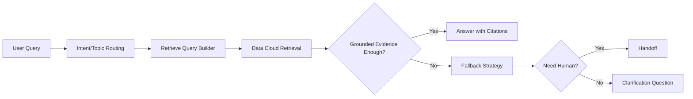

# 第6章 Data Cloud 与 RAG 接地

- 版本: v1
- 最后更新: 2026-02-28
- 章节定位: 开发实现与数据治理核心
- 预计学习时长: 150-180 分钟

## Summary

本章聚焦 Agentforce 的“有依据回答”能力建设。  
目标是让模型回答基于企业可信数据，而非自由生成。

完成本章后，学习者应能:

1. 设计可执行的数据源目录和分级策略。
2. 设计 Data Cloud 的摄取、检索、接地与回退路径。
3. 建立可量化的 RAG 质量指标与持续优化闭环。

## Decision / Changes

1. 采用“先数据治理，后检索配置”的顺序，避免先接入后补救。
2. 明确区分“运营数据（可变）”与“参考知识（相对稳定）”。
3. 将 `grounded answer`、`fallback`、`hallucination` 纳入发布门禁。

## 1. 学习目标

### 1.1 知识目标

1. 理解 Data Cloud 在 Agentforce RAG 架构中的角色。
2. 理解数据源可信分级与检索策略的关系。
3. 理解 RAG 安全约束与合规边界。

### 1.2 技能目标

1. 能构建 Data Source Catalog 并定义 owner、更新节奏、质量规则。
2. 能为不同响应场景配置检索与接地行为。
3. 能定义 RAG 评测指标并建立反馈回路。

### 1.3 交付目标

1. 一份数据源目录（含 trusted/non-trusted 分级）。
2. 一份检索与接地设计说明（含回退策略）。
3. 一份 RAG 评测与运维计划。

## 2. 前置知识

1. 第3章 Prompt 分层与会话设计。
2. 第4章 Topic 路由与边界。
3. 第5章 Action 契约设计。

## 3. RAG 架构与职责分层

### 3.1 端到端流程

### 3.2 组件职责

| 组件 | 职责 | 非职责 |
| --- | --- | --- |
| Data Cloud | 数据统一、索引、检索 | 决定最终业务动作 |
| Topic/Prompt | 决策检索时机与输出合同 | 直接存储业务数据 |
| Action | 执行写操作或外部调用 | 解释知识全文 |
| Guardrails | 安全与合规边界 | 提供业务答案依据 |

## 4. Data Source Catalog（数据源目录）

### 4.1 数据源分级

| Level | 定义 | 示例 | 可用于直接回答 |
| --- | --- | --- | --- |
| T1 Trusted | 官方且受控数据源 | 产品手册、政策文档、已审校FAQ | yes |
| T2 Conditional | 来源可信但更新不稳定 | 团队周报、内部wiki草稿 | conditional |
| T3 Non-trusted | 未审校或外部不明来源 | 未验证网页抓取 | no |

### 4.2 目录模板

| Source ID | Source Name | Owner | Cadence | Trust Level | Quality Checks | PII Risk |
| --- | --- | --- | --- | --- | --- | --- |
| SRC-001 | Product KB | Product Ops | weekly | T1 | 文档版本+发布日期校验 | low |
| SRC-002 | Support FAQ | Service Ops | daily | T1 | 重复项、过期项检测 | medium |
| SRC-003 | Sales Playbook | Sales Enablement | biweekly | T2 | 术语一致性检查 | low |

## 5. 摄取与质量控制（Ingestion Plan）

### 5.1 摄取计划必填项

1. source 与 owner
2. ingest cadence（daily/weekly/monthly）
3. 数据质量校验规则
4. 失败重试与告警规则

### 5.2 质量校验清单

| 校验项 | 规则 |
| --- | --- |
| Freshness | 超过阈值未更新则降级可用性 |
| Duplicate | 重复内容去重并记录主版本 |
| Metadata | 文档需带版本号、日期、来源 |
| Language | 多语言内容需明确 locale |
| Compliance | 敏感字段脱敏或剔除 |

### 5.3 摄取失败处理

1. 失败重试 1-2 次后告警。
2. 若 T1 数据源连续失败，触发发布冻结或能力降级。
3. 将失败事件写入 incident 日志并追踪 owner。

## 6. 检索与接地设计（Retrieval & Grounding）

### 6.1 场景化检索策略

| 场景 | 检索范围 | 策略 |
| --- | --- | --- |
| 产品问答 | T1 产品知识 + FAQ | 必须引用依据 |
| 政策规则问答 | T1 政策文档 | 严格版本优先 |
| 非结构化咨询 | T1 + T2（有条件） | 低置信度时追问 |

### 6.2 接地行为规则

1. 仅基于检索到的证据回答关键事实。
2. 证据不足时不编造，进入 fallback。
3. 对关键结论输出引用或来源摘要。

### 6.3 Fallback 设计

| 条件 | 行为 |
| --- | --- |
| 无证据命中 | 说明暂无依据并请求补充上下文 |
| 证据冲突 | 返回冲突提示并转人工 |
| 证据过期 | 标注“信息可能过期”，建议人工确认 |
| 高风险请求 | 直接转人工，不自动回答 |

## 7. 安全与合规约束

### 7.1 基线约束

1. 敏感信息默认不出现在回答中。
2. 禁止跨客户数据拼接回答。
3. 高风险领域（法务、价格承诺）优先 handoff。

### 7.2 PII 与日志要求

| 场景 | 要求 |
| --- | --- |
| 回答输出 | PII 脱敏显示 |
| 运行日志 | 记录 request_id，不落原始敏感值 |
| 审计复核 | 保留来源与检索路径 |

## 8. 评测指标与运维闭环

### 8.1 指标体系

| 指标 | 目标值 |
| --- | --- |
| Grounded Answer Rate | >= 90% |
| Citation Coverage | >= 85% |
| Hallucination Rate | <= 2% |
| Retrieval Latency p95 | <= 2.5s |
| End-to-End Latency p95 | <= 8s |

### 8.2 评测数据集设计

1. 正常样例：高频问答场景。
2. 边界样例：模糊表达、跨主题问题。
3. 禁止样例：越权、敏感、诱导编造。
4. 失败样例：无命中、冲突证据、过期证据。

### 8.3 运营反馈循环

1. 收集生产失败样本。
2. 分类归因（数据质量/检索策略/提示词/权限）。
3. 更新数据源或策略并回归验证。
4. 月度复盘指标趋势与风险项。

## 9. 实操练习（必做 + 可选）

### 9.1 必做练习: 设计一版 RAG 实施包

任务:

1. 产出 1 份 Data Source Catalog（至少 6 个数据源）。
2. 产出 1 份 Retrieval Strategy（至少 3 个场景）。
3. 产出 1 份 Fallback Matrix（至少 4 条）。
4. 定义 8 条评测样例和 5 个核心指标。

预期结果: 形成可进入 UAT 的 RAG 设计文档。

### 9.2 可选练习: 证据冲突处置演练

任务:

1. 构造 3 组冲突证据场景。
2. 验证系统是否按规则拒答或转人工。
3. 输出冲突处置 SOP。

预期结果: 形成冲突治理规则 v1。

## 10. 常见错误与排障

| 问题 | 现象 | 修正建议 |
| --- | --- | --- |
| 未分级数据源 | 回答质量波动大 | 建立 trusted 分级 |
| 只做接入不做质量检查 | 过期错误信息进入回答 | 增加 freshness/metadata 校验 |
| 无 fallback | 无证据时仍强答 | 强制无依据拒答/转人工 |
| 指标只看准确率 | 忽略延迟和稳定性 | 增加 latency 与失败率指标 |
| 无反馈闭环 | 同类错误重复发生 | 生产样本回灌评测集 |

## 11. 练习题

### 11.1 选择题

1. 下列哪类数据源最适合直接用于关键业务回答？
   - A. 未验证外部网页
   - B. 团队聊天记录
   - C. 已审校官方知识文档
   - D. 临时草稿
2. 当检索无依据命中时，正确策略是：
   - A. 编造合理答案
   - B. 输出通用猜测
   - C. 触发 fallback（追问或转人工）
   - D. 静默返回空
3. 下列哪项更能衡量 RAG 质量？
   - A. 文案长度
   - B. Citation Coverage
   - C. 主题数量
   - D. 页面配色

答案：1-C，2-C，3-B。

### 11.2 实作题

题目：为“售后政策问答助手”设计一版 RAG 方案，至少包含:

1. 5 个数据源及信任分级。
2. 3 类检索场景与对应接地策略。
3. 1 份评测指标表（至少 5 项）。

评分参考：

1. 数据治理完整性（40分）
2. 接地策略可执行性（40分）
3. 指标可测性（20分）

## 12. 验收标准（章节通过条件）

1. 输出 Data Source Catalog，包含 owner、cadence、trust、quality checks。
2. 输出 Retrieval + Fallback 设计，覆盖主要业务场景。
3. 评测样例通过率 >= 90%，练习题得分 >= 80 分。

## 13. 参考资料

1. [../04-Integration/Data-Cloud.md](../04-Integration/Data-Cloud.md)
2. [../06-Patterns/RAG-Pattern.md](../06-Patterns/RAG-Pattern.md)
3. [../02-Build-HowTo/Guardrails/Data-Access-Control.md](../02-Build-HowTo/Guardrails/Data-Access-Control.md)
4. [../02-Build-HowTo/Testing/Test-Strategy.md](../02-Build-HowTo/Testing/Test-Strategy.md)
5. [../08-Samples/Case-001-SDR-Lead-Nurturing/04-Test-Cases-and-Dataset.md](../08-Samples/Case-001-SDR-Lead-Nurturing/04-Test-Cases-and-Dataset.md)

## 14. 版本敏感假设

1. Data Cloud 摄取与索引能力会随版本变化，参数需以目标 org 为准。
2. 不同区域与合规要求下，数据可用范围和保留策略不同。

## Risks / Known Issues

1. 若数据源 owner 不明确，内容过期后无法快速修复。
2. 若无证据冲突处理机制，关键问答会出现不一致答复。
3. 仅优化准确率而忽略时延，会影响生产体验。

## Next Steps

1. 进入第7章，完成集成与身份设计（OAuth/外部系统）。
2. 将本章指标接入监控面板并设置告警阈值。
3. 建立 RAG 月度治理例会（数据源质量、误答复盘、策略调整）。
