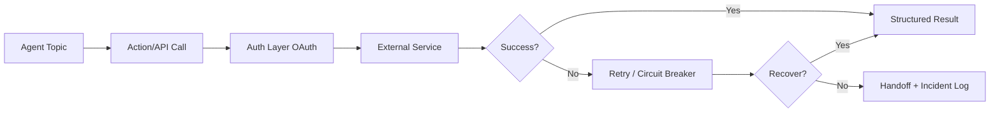

# 第7章 集成与身份（OAuth/外部系统）

- 版本: v1
- 最后更新: 2026-02-28
- 章节定位: 开发实现与企业集成核心
- 预计学习时长: 150-180 分钟

## Summary

本章聚焦 Agentforce 与外部系统互联时最关键的两件事:

1. 身份与授权（谁以什么权限调用什么能力）。
2. 集成稳定性（失败时如何降级、回退、追踪）。

完成本章后，学习者应能独立设计一版“可上线”的集成方案，包含 OAuth 选型、连接器治理、超时重试、审计与安全边界。

## Decision / Changes

1. 采用“身份先行、接口其次”的设计顺序，先定义主体与权限再定义 API。
2. 集成方案统一按 `调用方 -> 认证 -> 授权 -> 目标系统 -> 回退` 五层表达。
3. 将外部系统故障场景纳入必测范围，不接受只测 happy path。

## 1. 学习目标

### 1.1 知识目标

1. 理解 Agentforce 外部集成架构与常见连接方式（API/MCP/中间层）。
2. 理解 OAuth 常见授权模式及适用边界。
3. 理解身份隔离、最小权限与审计追踪的治理原则。

### 1.2 技能目标

1. 能完成外部系统集成选型（直连/MuleSoft/MCP）。
2. 能为不同场景选择合适 OAuth 模式并定义 scope。
3. 能设计集成失败处理策略（重试、熔断、人工接管）。

### 1.3 交付目标

1. 一份集成架构图与接口清单。
2. 一份 OAuth/身份映射表。
3. 一份外部系统故障处理与监控方案。

## 2. 前置知识

1. 第4章 Topic 路由与边界设计。
2. 第5章 Action 契约设计。
3. 第6章 Data Cloud 与 RAG 接地。

## 3. 集成架构总览

### 3.1 三类集成路径

| 路径 | 适用场景 | 优势 | 风险 |
| --- | --- | --- | --- |
| Direct API | 系统少、接口简单 | 路径短、延迟低 | 连接点增多，治理复杂 |
| Integration Layer（如 MuleSoft） | 系统多、协议复杂 | 统一治理与编排 | 引入中间层成本 |
| MCP Connector | 需要标准化工具接入 | 协议统一、复用高 | 生态仍在演进 |

### 3.2 参考流程

## 4. 身份与 OAuth 设计

### 4.1 身份主体模型

| 主体 | 用途 | 关键约束 |
| --- | --- | --- |
| Agent Service Identity | 自动化动作调用 | 最小权限、不可共享人类账号 |
| End User Delegated Identity | 用户授权代表操作 | 明确用户同意与范围 |
| Admin Integration Identity | 配置与调试 | 仅限管理操作，不用于运行流量 |

### 4.2 OAuth 授权模式选型

| 模式 | 适用场景 | 不适用场景 |
| --- | --- | --- |
| Client Credentials | 服务到服务调用 | 需要用户上下文授权 |
| Authorization Code | 代表最终用户操作 | 无法交互登录的后端任务 |
| JWT Bearer | 服务器间可信代理 | 缺乏密钥治理能力场景 |

说明：最终以目标系统支持能力和企业安全政策为准。

### 4.3 Scope 与最小权限

1. 一个集成接口对应最小 scope 集合。
2. 写操作 scope 与读操作 scope 分离。
3. 高风险 scope（删除、审批）必须审批后启用。

### 4.4 Token 治理

| 项目 | 建议 |
| --- | --- |
| Access Token TTL | 尽量短时有效 |
| Refresh Token | 仅在必要场景启用 |
| Secret Rotation | 至少季度轮换 |
| Token Storage | 使用安全凭据服务，不落明文 |

## 5. 接口契约与动作映射

### 5.1 API Contract 必填项

1. endpoint 与 method
2. request schema / response schema
3. timeout / retry / rate limit
4. error mapping
5. idempotency key（写操作）

### 5.2 Agent Action 与外部 API 映射样例

| Action | External API | 读写属性 | 失败回退 |
| --- | --- | --- | --- |
| GetOrderStatus | `GET /orders/{id}` | Read | 返回“暂不可用”并追问 |
| CreateSupportTicket | `POST /tickets` | Write | 重试一次后转人工 |
| CancelSubscription | `POST /subs/{id}/cancel` | High-risk write | 强制审批+人工确认 |

## 6. 稳定性与故障治理

### 6.1 超时与重试基线

1. 读取接口：timeout 2-3s，重试 0-1 次。
2. 写入接口：timeout 3-5s，重试 1 次（需幂等）。
3. 外部慢接口：timeout 5-8s，失败进入降级或 handoff。

### 6.2 熔断与降级

| 场景 | 策略 |
| --- | --- |
| 连续失败率高 | 打开熔断，暂停自动调用 |
| 单接口超时激增 | 降级为只读或人工流程 |
| 上游恢复 | 半开探测后恢复流量 |

### 6.3 错误分层处理

| 错误层 | 示例 | 处理 |
| --- | --- | --- |
| 认证错误 | token invalid | 刷新凭据并告警 |
| 授权错误 | scope denied | 拒绝执行并转人工 |
| 业务错误 | invalid state | 返回可理解提示 |
| 系统错误 | 5xx / timeout | 重试+熔断+事件升级 |

## 7. 安全与审计

### 7.1 安全控制清单

1. 所有外部连接使用命名凭据或集中凭据管理。
2. 禁止在 Prompt、日志、配置文件中硬编码密钥。
3. 高风险动作要求二次确认与操作留痕。
4. 连接器变更纳入发布审批流程。

### 7.2 审计字段清单

| 字段 | 作用 |
| --- | --- |
| request_id | 全链路追踪 |
| principal_id | 调用身份追踪 |
| external_endpoint | 接口定位 |
| auth_mode | 审计认证方式 |
| response_code | 错误归因 |
| latency_ms | 性能监控 |

## 8. MCP 集成实践要点

### 8.1 推荐流程

1. 本地用 Inspector 验证 MCP Server 能力与 schema。
2. 部署到目标运行环境（Heroku/MuleSoft/BYO Runtime）。
3. 在 Data Libraries 添加 MCP Connector。
4. 配置最小权限与错误回退。
5. 纳入 Testing Center 回归。

### 8.2 MCP 风险提示

1. 连接器配置错误会导致工具不可调用。
2. 外部系统不稳定会放大 Agent 响应波动。
3. 版本演进快时需定期回归连接兼容性。

## 9. 实操练习（必做 + 可选）

### 9.1 必做练习: 设计“订单查询 + 取消”外部集成方案

任务:

1. 设计 3 个 Action 到外部 API 的映射。
2. 定义 1 套 OAuth 策略（模式 + scope + token治理）。
3. 设计超时、重试、熔断与 handoff 规则。
4. 给出 8 条集成测试样例（含 3 条失败样例）。

预期结果: 形成可用于架构评审的集成方案文档。

### 9.2 可选练习: MCP 连接演练

任务:

1. 定义 1 个 MCP 工具清单。
2. 设计输入输出 schema 与错误映射。
3. 设计发布前检查表（认证、连通、回退、审计）。

预期结果: 形成 MCP 接入清单 v1。

## 10. 常见错误与排障

| 问题 | 现象 | 修正建议 |
| --- | --- | --- |
| 身份主体混用 | 审计无法追溯责任 | 运行身份与管理身份分离 |
| scope 过大 | 越权风险上升 | 按动作拆分最小 scope |
| 无幂等机制 | 写操作重复执行 | 所有写操作定义幂等键 |
| 只测成功流 | 生产故障时无回退 | 补齐超时/401/403/5xx 测试 |
| 凭据轮换无流程 | 过期导致全量失败 | 建立轮换与演练机制 |

## 11. 练习题

### 11.1 选择题

1. 服务到服务调用最常见的 OAuth 选择是：
   - A. Authorization Code
   - B. Client Credentials
   - C. Device Code
   - D. 随机密钥
2. 写操作重试前最关键的前提是：
   - A. 文案更短
   - B. 幂等保证
   - C. 增加 Topic 数量
   - D. 提高超时阈值到无限
3. 当外部接口持续 5xx 时，合理策略是：
   - A. 无限重试
   - B. 直接忽略失败
   - C. 启动熔断并降级/转人工
   - D. 修改用户问题

答案：1-B，2-B，3-C。

### 11.2 实作题

题目：为“售后工单同步”设计一版集成与身份方案，至少包含：

1. 2 种身份主体与授权边界。
2. 3 个接口契约与错误映射。
3. 1 套降级回退方案与监控指标。

评分参考：

1. 身份与权限设计（40分）
2. 稳定性设计（40分）
3. 文档可执行性（20分）

## 12. 验收标准（章节通过条件）

1. 输出集成架构图和 OAuth 映射表，审查通过。
2. 关键接口具备 timeout/retry/idempotency/error mapping。
3. 集成测试通过率 >= 90%，练习题得分 >= 80 分。

## 13. 参考资料

1. [../04-Integration/Identity-OAuth.md](../04-Integration/Identity-OAuth.md)
2. [../04-Integration/External-Systems.md](../04-Integration/External-Systems.md)
3. [../04-Integration/mcp-solutions-for-developers.md](../04-Integration/mcp-solutions-for-developers.md)
4. [../02-Build-HowTo/Actions/API-Actions.md](../02-Build-HowTo/Actions/API-Actions.md)
5. [../02-Build-HowTo/Deployment/Release-Checklist.md](../02-Build-HowTo/Deployment/Release-Checklist.md)

## 14. 版本敏感假设

1. OAuth 支持模式和连接器能力受目标系统与版本影响。
2. MCP 相关能力可能持续迭代，需按发布节奏定期回归。

## Risks / Known Issues

1. 外部系统 SLA 不稳定会直接影响 Agent 成功率。
2. 若身份治理不严格，容易出现越权或审计不完整问题。
3. 多系统并行集成时，故障归因复杂度显著上升。

## Next Steps

1. 进入第8章，完成测试策略与评测数据集设计。
2. 将本章接口清单纳入发布检查表并配置监控告警。
3. 每月执行一次凭据轮换与熔断演练。
